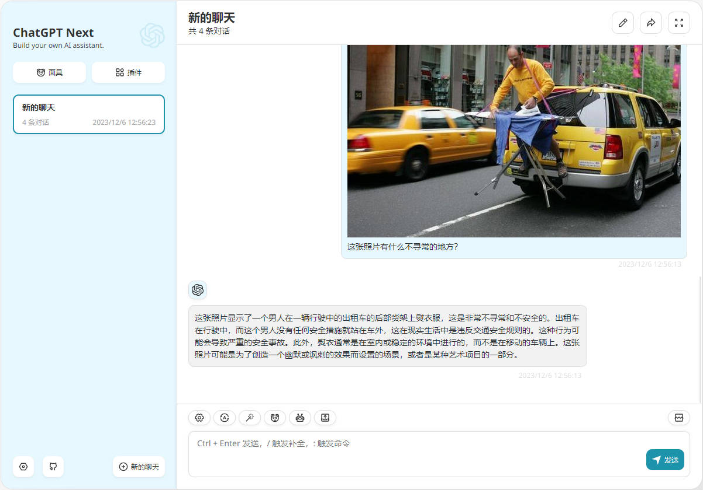
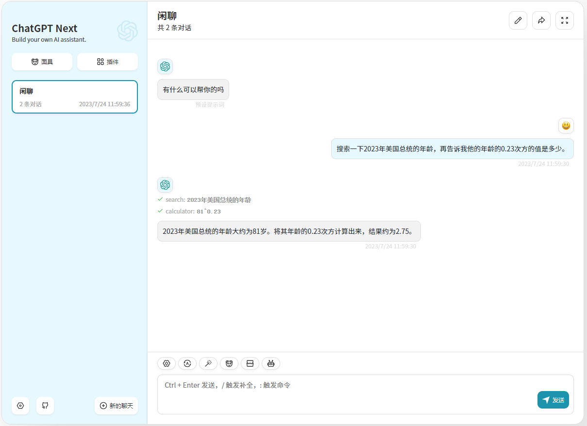
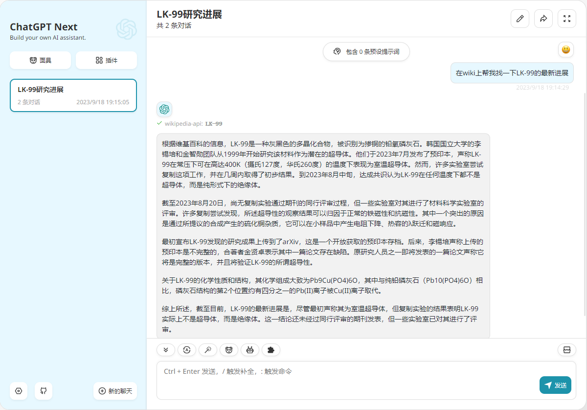
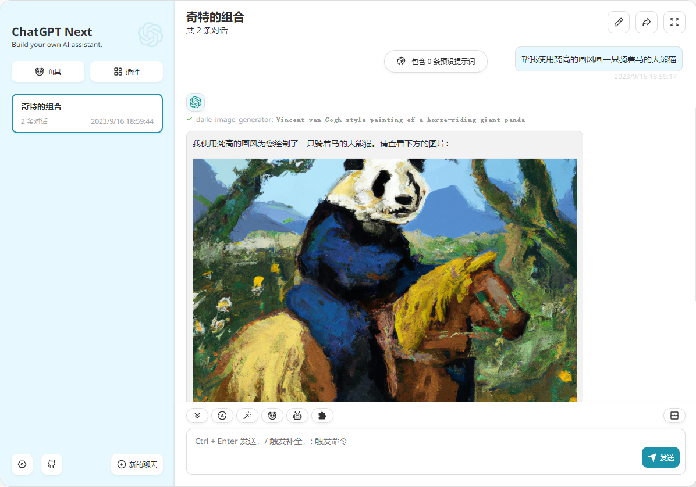

<div align="center">


<h1 align="center">NextChat (ChatGPT Next Web)</h1>

English / [简体中文](./README_CN.md)

One-Click to get a well-designed cross-platform ChatGPT web UI, with GPT3, GPT4 & Gemini Pro support.
<h1 align="center">ChatGPT Next Web LangChain</h1>

一键免费部署你的跨平台私人 ChatGPT 应用（基于 LangChain 实现插件功能）, 支持 GPT3, GPT4 & Gemini Pro 模型。

[![Web][Web-image]][web-url]
[![Windows][Windows-image]][download-url]
[![MacOS][MacOS-image]][download-url]
[![Linux][Linux-image]][download-url]

[Web App](https://chat-gpt-next-web.vercel.app/) / [Desktop App](https://github.com/Yidadaa/ChatGPT-Next-Web/releases) / [Discord](https://discord.gg/YCkeafCafC) / [Twitter](https://twitter.com/mortiest_ricky) / [Buy Me a Coffee](https://www.buymeacoffee.com/yidadaa)

[网页版](https://chatgpt.nextweb.fun/) / [客户端](https://github.com/Yidadaa/ChatGPT-Next-Web/releases) / [反馈](https://github.com/Yidadaa/ChatGPT-Next-Web/issues) / [QQ 群](https://github.com/Yidadaa/ChatGPT-Next-Web/discussions/1724) / [打赏开发者](https://user-images.githubusercontent.com/16968934/227772541-5bcd52d8-61b7-488c-a203-0330d8006e2b.jpg)

[web-url]: https://chatgpt.nextweb.fun
[download-url]: https://github.com/Yidadaa/ChatGPT-Next-Web/releases
[Web-image]: https://img.shields.io/badge/Web-PWA-orange?logo=microsoftedge
[Windows-image]: https://img.shields.io/badge/-Windows-blue?logo=windows
[MacOS-image]: https://img.shields.io/badge/-MacOS-black?logo=apple
[Linux-image]: https://img.shields.io/badge/-Linux-333?logo=ubuntu

[](https://vercel.com/new/clone?repository-url=https%3A%2F%2Fgithub.com%2FYidadaa%2FChatGPT-Next-Web&env=OPENAI_API_KEY&env=CODE&env=GOOGLE_API_KEY&project-name=chatgpt-next-web&repository-name=ChatGPT-Next-Web)

[](https://zeabur.com/templates/ZBUEFA)

[](https://gitpod.io/#https://github.com/Hk-Gosuto/ChatGPT-Next-Web-LangChain)









</div>

## Features

- **Deploy for free with one-click** on Vercel in under 1 minute
- Compact client (~5MB) on Linux/Windows/MacOS, [download it now](https://github.com/Yidadaa/ChatGPT-Next-Web/releases)
- Fully compatible with self-deployed LLMs, recommended for use with [RWKV-Runner](https://github.com/josStorer/RWKV-Runner) or [LocalAI](https://github.com/go-skynet/LocalAI)
- Privacy first, all data is stored locally in the browser
- Markdown support: LaTex, mermaid, code highlight, etc.
- Responsive design, dark mode and PWA
- Fast first screen loading speed (~100kb), support streaming response
- New in v2: create, share and debug your chat tools with prompt templates (mask)
- Awesome prompts powered by [awesome-chatgpt-prompts-zh](https://github.com/PlexPt/awesome-chatgpt-prompts-zh) and [awesome-chatgpt-prompts](https://github.com/f/awesome-chatgpt-prompts)
- Automatically compresses chat history to support long conversations while also saving your tokens
- I18n: English, 简体中文, 繁体中文, 日本語, Français, Español, Italiano, Türkçe, Deutsch, Tiếng Việt, Русский, Čeština, 한국어, Indonesia

## Roadmap

- [x] System Prompt: pin a user defined prompt as system prompt [#138](https://github.com/Yidadaa/ChatGPT-Next-Web/issues/138)
- [x] User Prompt: user can edit and save custom prompts to prompt list
- [x] Prompt Template: create a new chat with pre-defined in-context prompts [#993](https://github.com/Yidadaa/ChatGPT-Next-Web/issues/993)
- [x] Share as image, share to ShareGPT [#1741](https://github.com/Yidadaa/ChatGPT-Next-Web/pull/1741)
- [x] Desktop App with tauri
- [x] Self-host Model: Fully compatible with [RWKV-Runner](https://github.com/josStorer/RWKV-Runner), as well as server deployment of [LocalAI](https://github.com/go-skynet/LocalAI): llama/gpt4all/rwkv/vicuna/koala/gpt4all-j/cerebras/falcon/dolly etc.
- [ ] Plugins: support network search, calculator, any other apis etc. [#165](https://github.com/Yidadaa/ChatGPT-Next-Web/issues/165)

## What's New

- 🚀 v2.0 is released, now you can create prompt templates, turn your ideas into reality! Read this: [ChatGPT Prompt Engineering Tips: Zero, One and Few Shot Prompting](https://www.allabtai.com/prompt-engineering-tips-zero-one-and-few-shot-prompting/).
- 🚀 v2.7 let's share conversations as image, or share to ShareGPT!
- 🚀 v2.8 now we have a client that runs across all platforms!
- 🚀 v2.9.11 you can use azure endpoint now.

## 主要功能

- 除插件工具外，与原项目保持一致 [ChatGPT-Next-Web 主要功能](https://github.com/Yidadaa/ChatGPT-Next-Web#主要功能)
- 支持 GPT-4V(视觉) 模型
  - 需要配置对象存储服务，请参考 [对象存储服务配置指南](./docs/s3-oss.md) 配置

- 基于 [LangChain](https://github.com/hwchase17/langchainjs) 实现的插件功能，目前支持以下插件，未来会添加更多
  - 搜索
    - [SerpAPI](https://js.langchain.com/docs/api/tools/classes/SerpAPI)
    - [BingSerpAPI](https://js.langchain.com/docs/api/tools/classes/BingSerpAPI)
    - DuckDuckGo
  - 计算
    - [Calculator](https://js.langchain.com/docs/api/tools_calculator/classes/Calculator)
  - 网络请求
    - [WebBrowser](https://js.langchain.com/docs/api/tools_webbrowser/classes/WebBrowser)
    - PDFBrowser
      - ⚠ 仅在非vercel环境部署时可用 ⚠
  - 其它
    - [Wiki](https://js.langchain.com/docs/api/tools/classes/WikipediaQueryRun)
    - DALL-E 3
      - DALL-E 3 插件需要配置对象存储服务，请参考 [对象存储服务配置指南](./docs/s3-oss.md) 配置
    - StableDiffusion
      - 本插件目前为测试版本，后续可能会有较大的变更，请谨慎使用
      - 使用本插件需要一定的专业知识，Stable Diffusion 本身的相关问题不在本项目的解答范围内，如果您确定要使用本插件请参考 [Stable Diffusion 插件配置指南](./docs/stable-diffusion-plugin-cn.md) 文档进行配置
      - StableDiffusion 插件需要配置对象存储服务，请参考 [对象存储服务配置指南](./docs/s3-oss.md) 配置
    - Arxiv

## 开发计划

- [x] 支持使用 DuckDuckGo 作为默认搜索引擎

  当前配置 `SERPAPI_API_KEY` 时优先使用 `SerpAPI` 作为搜索插件，不配置时默认使用 `DuckDuckGo` 作为搜索插件。

  当前配置 `BING_SEARCH_API_KEY` 时优先使用 `BingSerpAPI` 作为搜索插件，不配置时默认使用 `DuckDuckGo` 作为搜索插件。

  优先级：`SerpAPI > BingSerpAPI > DuckDuckGo`

- [x] 插件列表页面开发
- [x] 支持开关指定插件
- [ ] 支持添加自定义插件
- [x] 支持 Agent 参数配置（ ~~agentType~~, maxIterations, returnIntermediateSteps 等）
- [x] 支持 ChatSession 级别插件功能开关

  仅在使用非 `0301` 和 `0314` 版本模型时会出现插件开关，其它模型默认为关闭状态，开关也不会显示。

## 已知问题
- [x] ~~使用插件时需将模型切换为 `0613` 版本模型，如：`gpt-3.5-turbo-0613`~~

  尝试使用 `chat-conversational-react-description` 等类型的 `agent` 使用插件时效果并不理想，不再考虑支持其它版本的模型。

  限制修改为非 `0301` 和 `0314` 模型均可调用插件。 [#10](https://github.com/Hk-Gosuto/ChatGPT-Next-Web-LangChain/issues/10)
- [x] `SERPAPI_API_KEY` 目前为必填，后续会支持使用 DuckDuckGo 替换搜索插件
- [x] Agent 不支持自定义接口地址
- [x] ~~部分场景下插件会调用失败~~

  问题出现在使用 [Calculator](https://js.langchain.com/docs/api/tools_calculator/classes/Calculator) 进行计算时的参数错误，暂时无法干预。
- [x] 插件调用失败后无反馈

## 最新动态

- 🚀 v2.9.5 正式版本发布
- 🚀 v2.9.1-plugin-preview 预览版发布。

## 开始使用

1. 准备好你的 [OpenAI API Key](https://platform.openai.com/account/api-keys);
2. 点击右侧按钮开始部署：
   [](https://vercel.com/new/clone?repository-url=https%3A%2F%2Fgithub.com%2FHk-Gosuto%2FChatGPT-Next-Web-LangChain&env=OPENAI_API_KEY,CODE&project-name=chatgpt-next-web-langchain&repository-name=ChatGPT-Next-Web-LangChain)，直接使用 Github 账号登录即可，记得在环境变量页填入 API Key 和[页面访问密码](#配置页面访问密码) CODE；
3. 部署完毕后，即可开始使用；
4. （可选）[绑定自定义域名](https://vercel.com/docs/concepts/projects/domains/add-a-domain)：Vercel 分配的域名 DNS 在某些区域被污染了，绑定自定义域名即可直连。

## FAQ

[简体中文 > 常见问题](./docs/faq-cn.md)

[English > FAQ](./docs/faq-en.md)

[Azure OpenAI](./docs/azure-openai-cn.md)

## 配置页面访问密码

> 配置密码后，用户需要在设置页手动填写访问码才可以正常聊天，否则会通过消息提示未授权状态。

> **警告**：请务必将密码的位数设置得足够长，最好 7 位以上，否则[会被爆破](https://github.com/Yidadaa/ChatGPT-Next-Web/issues/518)。

本项目提供有限的权限控制功能，请在 Vercel 项目控制面板的环境变量页增加名为 `CODE` 的环境变量，值为用英文逗号分隔的自定义密码：

```
code1,code2,code3
```

增加或修改该环境变量后，请**重新部署**项目使改动生效。

## 环境变量

> 本项目大多数配置项都通过环境变量来设置，教程：[如何修改 Vercel 环境变量](./docs/vercel-cn.md)。

### `OPENAI_API_KEY` （必填项）

OpanAI 密钥，你在 openai 账户页面申请的 api key。

### `SERPAPI_API_KEY` (可选)

[SerpApi: Google Search API](https://serpapi.com/)

### `BING_SEARCH_API_KEY` (可选)

[Web Search API | Microsoft Bing](https://www.microsoft.com/en-us/bing/apis/bing-web-search-api)

### `CHOOSE_SEARCH_ENGINE` (可选)

此项为直连搜索引擎，免去api试用量小的烦恼，但可能因为网络问题导致无法使用

可选项如下：

- google
- baidu

### `CODE` （可选）

访问密码，可选，可以使用逗号隔开多个密码。

**警告**：如果不填写此项，则任何人都可以直接使用你部署后的网站，可能会导致你的 token 被急速消耗完毕，建议填写此选项。

### `BASE_URL` （可选）

> Default: `https://api.openai.com`

> Examples: `http://your-openai-proxy.com`

OpenAI 接口代理 URL，如果你手动配置了 openai 接口代理，请填写此选项。

### `OPENAI_ORG_ID` (optional)

Specify OpenAI organization ID.

### `AZURE_URL` (optional)

> Example: https://{azure-resource-url}/openai/deployments/{deploy-name}

Azure deploy url.

### `AZURE_API_KEY` (optional)

Azure Api Key.

### `GOOGLE_URL` (optional)

Google Gemini Pro Api Url.

### `HIDE_USER_API_KEY` (optional)

### 容器部署 （推荐）

> Docker 版本需要在 20 及其以上，否则会提示找不到镜像。

> ⚠️ 注意：docker 版本在大多数时间都会落后最新的版本 1 到 2 天，所以部署后会持续出现“存在更新”的提示，属于正常现象。

```shell
docker run -d -p 3000:3000 \
   -e OPENAI_API_KEY="sk-xxxx" \
   -e CODE="页面访问密码" \
   gosuto/chatgpt-next-web-langchain
```

你也可以指定 proxy：

```shell
docker run -d -p 3000:3000 \
   -e OPENAI_API_KEY="sk-xxxx" \
   -e CODE="页面访问密码" \
   --net=host \
   -e PROXY_URL="http://127.0.0.1:7890" \
   gosuto/chatgpt-next-web-langchain
```

如果你的本地代理需要账号密码，可以使用：

```shell
-e PROXY_URL="http://127.0.0.1:7890 user password"
```

如果你需要指定其他环境变量，请自行在上述命令中增加 `-e 环境变量=环境变量值` 来指定。

## 同步聊天记录（UpStash）

| [简体中文](./docs/synchronise-chat-logs-cn.md) | [English](./docs/synchronise-chat-logs-en.md) | [Italiano](./docs/synchronise-chat-logs-es.md) | [日本語](./docs/synchronise-chat-logs-ja.md) | [한국어](./docs/synchronise-chat-logs-ko.md)


## 贡献者

<a href="https://github.com/pacmandoh/ChatGPT-Next-Web/graphs/contributors">
  
</a>

## 截图


## 捐赠

[请项目原作者喝杯咖啡](https://www.buymeacoffee.com/yidadaa)

## 感谢


感谢 [jetbrains](https://www.jetbrains.com/) 为本项目提供的 [开源许可证](https://www.jetbrains.com/community/opensource/)

## 开源协议

[MIT](https://opensource.org/license/mit/)
